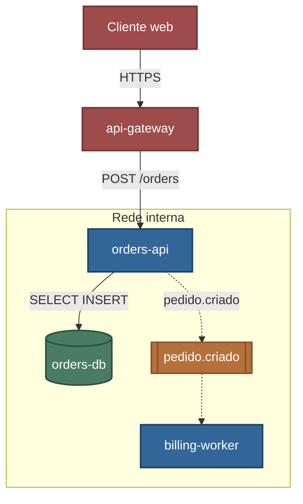
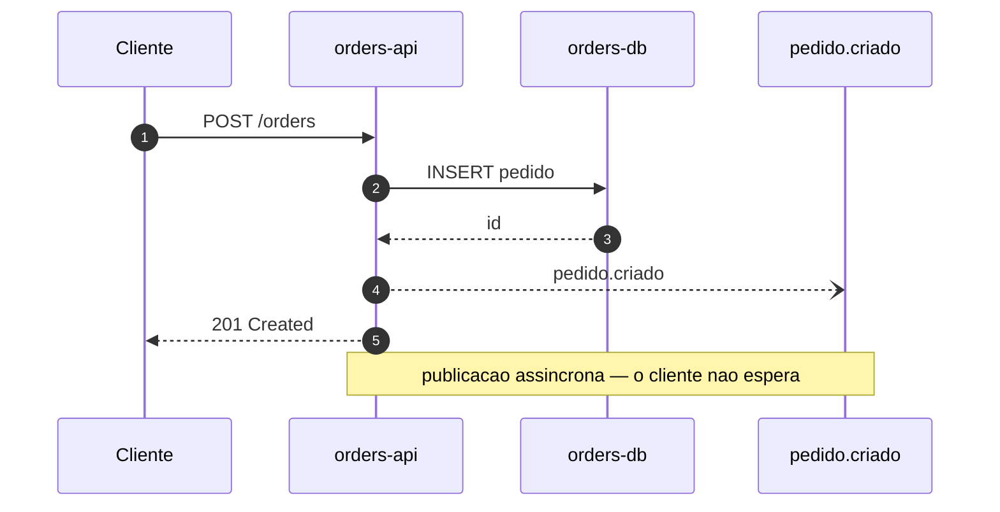
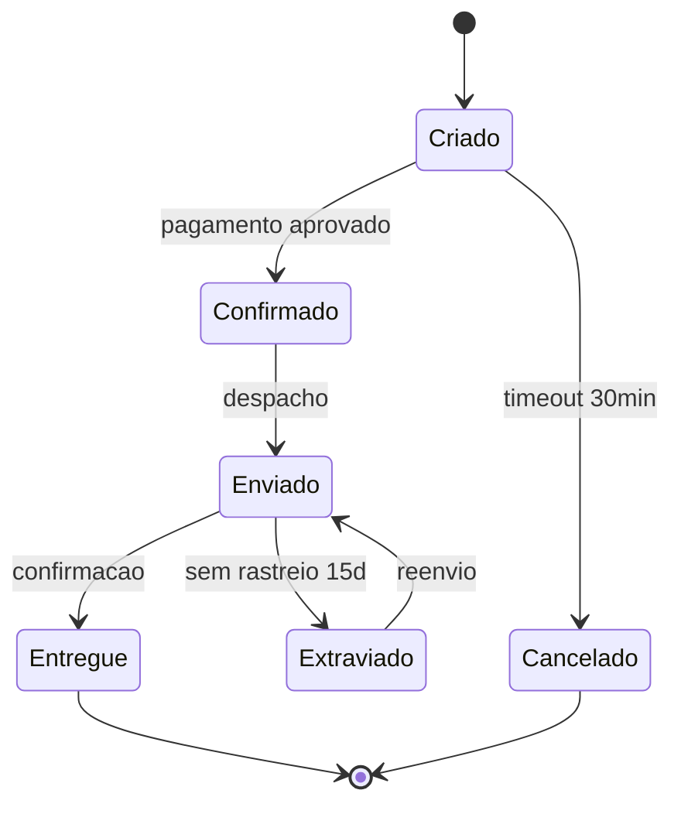
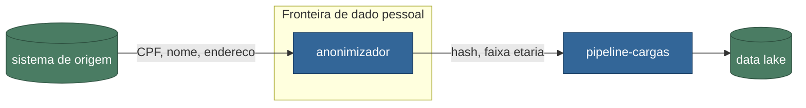

# Emitir em Mermaid

## Classes — declare uma vez, no topo

```
classDef backend    fill:#336698,stroke:#1F4266,color:#FFFFFF,stroke-width:2px
classDef storage    fill:#4A7C63,stroke:#2E5140,color:#FFFFFF,stroke-width:2px
classDef broker     fill:#B5713C,stroke:#8A5228,color:#FFFFFF,stroke-width:2px
classDef acesso     fill:#9E4B4B,stroke:#733535,color:#FFFFFF,stroke-width:2px
classDef componente fill:#B39038,stroke:#8A6E26,color:#1A1A1A,stroke-width:2px
classDef externo    fill:#6B7280,stroke:#4B5563,color:#FFFFFF,stroke-width:2px
classDef destaque   fill:#98CBFF,stroke:#336698,color:#1A1A1A,stroke-width:3px
```

Aplique com `class no1,no2 backend`, ou direto no no com `:::backend`.

## Arquitetura



Forma do no carrega tipo: cilindro para banco, subrotina para fila, retangulo para servico.

## Sequencia



Setas: `->>` sincrono, `--)` assincrono, `-->>` retorno. Use `autonumber` para poder referenciar
os passos no texto.

## Ciclo de vida



Inclua o caminho de erro: timeout, extravio, reenvio. Sao os que causam incidente, e os que quem
implementa esquece.

## Fluxo de dados



Rotule a aresta com **o que** trafega, nao com o verbo. Marque a fronteira de dado sensivel com
`subgraph` — e o que torna o diagrama util numa revisao de conformidade.

## Limites

Sem logo de empresa — use rotulo textual. Layout automatico: para posicionamento controlado, o
renderer e `archify`.

Direcao: `TB` para hierarquia e camada, `LR` para fluxo e pipeline.
